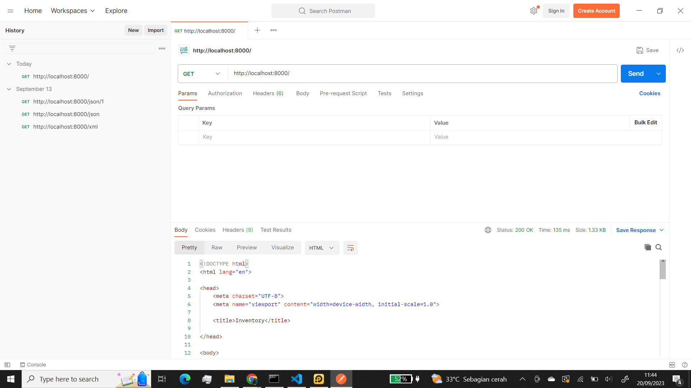
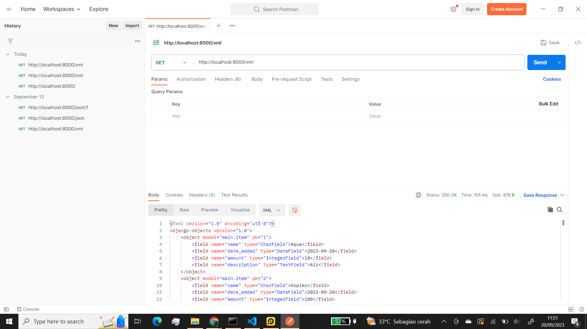
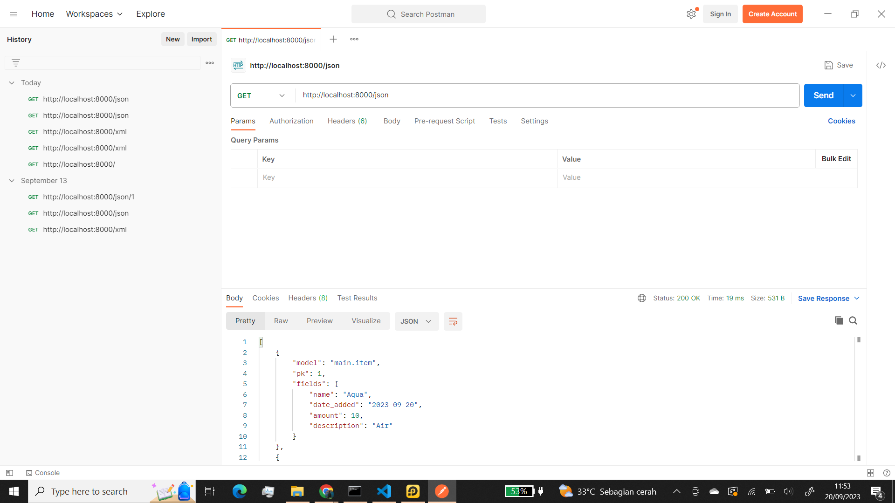
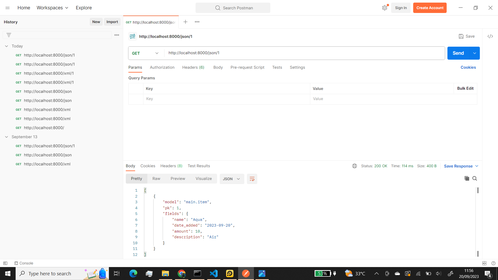

    
Tugas 2

https://storehousepbp.adaptable.app/

1.
>Membuat sebuah proyek Django baru. 

Pertama buat direktori dengan nama aplikasi yang dibuat (storehousepbp) terus kalau sudah di inisiasi dengan menjalankan `git init` di cmd yang ada di direktori ini lalu buatlah virtual environment dengan menjalankan `py -m venv env` lalu aktifkan virtual environment tersebut dengan `env\Scripts\activate.bat` untuk di Windows.
Di direktori yang sama buatlah file dengan nama `requirements.txt` lalu tambahkan beberapa dependencies yang diperlukan untuk membuat projek django seperti django, gunicorn dan lain lain. lalu pasang dependencies tersebut dengan menjalankan perintah ini di virtual environment yang tadi sudah di aktifkan `pip install -r requirements.txt`.
Buatlah projek django dengan menjalankan `django-admin startproject storehousepbp .`. nama aplikasi nya sesuai yang ingin dibuat.  
>Membuat aplikasi dengan nama main pada proyek tersebut. 

Untuk membuat aplikasi dengan nama `main` jalankan perintah `py manage.py startapp main`.
Lalu masuk ke `settings.py` di direktori storehousepbp (aplikasi yang dibuat) lalu di bagian `INSTALLED_APPS` tambahkan 'main' ke dalam aplikasi.
>Melakukan routing pada proyek agar dapat menjalankan aplikasi main. 

Buatlah file bernama `urls.py` di direktori main lalu isi dengan kode : 
<pre>from django.urls import path
from main.views import show_main

app_name = 'main'

urlpatterns = [
    path('', show_main, name='show_main'),
]</pre>
Kemudian, masuk ke `urls.py` yang ada di direktori storehousepbp (aplikasi yang dibuat) kemudian tambahkan beberapa kode seperti : 
`from django.urls import path, include` hanya ditambahkan impor include dan  
`    path('main/', include('main.urls')),` ditambahkan di dalam urlspatterns  
>Membuat model pada aplikasi main dengan nama Item dan memiliki atribut wajib. 

Buka file `models.py` di direktori main lalu diisi dengan kode : 
<pre>from django.db import models

class Item(models.Model):
    name = models.CharField(max_length=255)
    date_added = models.DateField(auto_now_add=True)
    amount = models.IntegerField()
    description = models.TextField()</pre>
>Membuat sebuah fungsi pada views.py untuk dikembalikan ke dalam sebuah template HTML yang menampilkan nama aplikasi serta nama dan kelas kamu. 

Buka file `views.py` di direktori main lalu tambahkan kode : 
<pre>from django.shortcuts import render

def show_main(request):
    context = {
        'applications': 'storehousepbp', # isikan dengan nama aplikasi sendiri
        'name': 'Humam Al Labib', #isikan dengan nama sendiri
        'class': 'PBP F' # isikan dengan kelas kalian sendiri
    }

    return render(request, "main.html", context)</pre>
> Membuat sebuah routing pada urls.py aplikasi main untuk memetakan fungsi yang telah dibuat pada views.py. 

Buatlah file `urls.py` di direktori main lalu isikan kode :  
<pre>from django.urls import path
from main.views import show_main

app_name = 'main'

urlpatterns = [
    path('', show_main, name='show_main'),
]</pre>
>Melakukan deployment ke Adaptable terhadap aplikasi yang sudah dibuat sehingga nantinya dapat diakses oleh teman-temanmu melalui Internet. 

Tambahkan * di variabel ALLOWED_HOSTS di settings.py yang ada di direktori storehousepbp (aplikasi yang dibuat) 
`ALLOWED_HOSTS = ["*"]` 
Karena akun Adaptable sudah di disable jadi sudah tidak bisa di pakai lagi 
>Membuat sebuah README.md yang berisi tautan menuju aplikasi Adaptable yang sudah di-deploy, serta jawaban dari beberapa pertanyaan berikut. 

Buat file README.md lalu di add, commit, dan push ke dalam github atau buat file README.md di dalam github lalu edit di dalam github

2.  
Kaitan antara urls.py, views.py, models.py, dan berkas HTML adalah dasar dari kerangka kerja Django dalam mengembangkan aplikasi web. Setiap bagian memiliki peran dan tanggung jawabnya sendiri dalam proses pengembangan aplikasi. Berikut adalah penjelasan kaitan masing-masing komponen:

models.py: Berkas ini berisi definisi model-data yang digunakan oleh aplikasi Anda. Model adalah abstraksi dari entitas yang akan disimpan dalam database. Kaitan utama antara models.py dan komponen lainnya adalah: 
* Kaitan dengan views.py: Model digunakan oleh view untuk mengambil data dari database, memprosesnya, dan mengirimkannya ke template. View dapat menggunakan query database Django (ORM) untuk berinteraksi dengan model dan mendapatkan data yang diperlukan. 
views.py: Berkas ini berisi logika aplikasi web Anda, termasuk tindakan yang diambil saat pengguna mengunjungi URL tertentu. Kaitan antara views.py dan komponen lainnya adalah: 
* Kaitan dengan urls.py: View dihubungkan dengan URL melalui berkas urls.py. Anda mendefinisikan path URL yang mengarahkan ke view tertentu. Ketika pengguna mengakses URL tersebut, view yang sesuai akan dijalankan. 
* Kaitan dengan models.py: View sering digunakan untuk mengambil data dari model (database) menggunakan Django ORM. View dapat mengambil, memproses, dan mengirimkan data dari model ke template HTML. 
* Kaitan dengan berkas HTML: View juga bertanggung jawab untuk merender (mengisi) template HTML dengan data yang diperlukan. View menggunakan template tag Django untuk memasukkan data dari model ke dalam HTML sehingga data tersebut dapat ditampilkan kepada pengguna.

urls.py: Berkas ini berisi konfigurasi URL untuk aplikasi Anda. Ini menghubungkan URL dengan view yang sesuai. Kaitan antara urls.py dan komponen lainnya adalah: 
* Kaitan dengan views.py: Dalam urls.py, Anda mendefinisikan path URL yang mengarahkan ke view tertentu. Ini berarti URL tertentu akan mengeksekusi view yang sesuai saat diakses oleh pengguna.

Berkas HTML (Template): Template HTML digunakan untuk merender tampilan yang akan ditampilkan kepada pengguna. Kaitan antara berkas HTML dan komponen lainnya adalah: 
* Kaitan dengan views.py: View menggunakan template untuk merender tampilan. View mengirimkan data dari model ke template agar data tersebut dapat ditampilkan dalam HTML.

Dalam alur kerja tipikal Django, pengguna mengakses URL yang didefinisikan dalam urls.py. URL tersebut mengarahkan ke view yang sesuai dalam views.py. View menggunakan model-data dari models.py untuk mengambil atau memproses data. Kemudian, view merender template HTML yang menggabungkan data dari model dengan tampilan HTML yang sesuai. Hasil akhirnya adalah halaman web yang ditampilkan kepada pengguna.

Ini adalah inti dari pola desain Model-View-Controller (MVC) yang diadopsi oleh Django. Dalam pola ini, models.py berperan sebagai Model, views.py sebagai Controller, dan berkas HTML sebagai View. Django menggunakan pendekatan yang lebih dekat dengan Model-View-Template (MVT), di mana template berperan sebagai View, tetapi konsep dasarnya tetap sama. 

3. Berikut adalah beberapa alasan mengapa kita menggunakan virtual environment:

* Isolasi Proyek: Virtual environment memungkinkan kita untuk mengisolasi dependensi proyek tertentu dari lingkungan Python global. Ini berarti kita dapat memiliki versi yang berbeda dari paket Python di setiap proyek tanpa khawatir tentang konflik dependensi. Ini membantu mencegah masalah yang mungkin timbul ketika dua proyek menggunakan versi paket Python yang berbeda. 
* Mengelola Dependensi: Dengan venv, kita dapat dengan mudah menginstal, menghapus, dan mengelola paket Python yang dibutuhkan oleh proyek kita. Ini membuat pengelolaan dependensi proyek menjadi lebih teratur. 
* Memudahkan Deploy: Ketika kita ingin mengirimkan proyek ke server produksi, kita dapat dengan mudah meng-eksport daftar dependensi yang diperlukan dengan menggunakan requirements.txt, sehingga server produksi dapat menginstal paket-paket yang diperlukan. 
Isolasi Kesalahan: Jika ada masalah atau kesalahan dalam salah satu proyek, itu tidak akan mempengaruhi proyek lain yang ada di lingkungan yang sama.

Django Tanpa Virtual Environment

Meskipun kita dapat membuat aplikasi web berbasis Django tanpa menggunakan virtual environment, disarankan untuk selalu menggunakan virtual environment dalam pengembangan Django. Tanpa virtual environment, kita dapat mengalami masalah berikut:

* Konflik Dependensi: Proyek Django satu dapat menggunakan versi paket tertentu, sementara proyek lain menggunakan versi yang berbeda. Ini dapat menyebabkan konflik dependensi dan masalah yang sulit dilacak. 
* Kesulitan Manajemen Paket: Tanpa virtual environment, manajemen paket Python menjadi lebih sulit. kita harus berhati-hati dalam menginstal dan menghapus paket agar tidak mempengaruhi sistem Python global. 
* Ketergantungan pada Lingkungan Global: Penggunaan paket Python dari sistem global dapat membuat proyek kita bergantung pada versi paket yang ada di lingkungan tersebut, yang mungkin tidak selalu sesuai dengan kebutuhan proyek kita. 

4. MVC, MVT, dan MVVM

MVC (Model-View-Controller):

* Model: Bertanggung jawab atas struktur data dan logika bisnis. Ini berinteraksi dengan database. 
* View: Menampilkan data kepada pengguna dan menerima input dari pengguna. Ini mengirim permintaan ke Controller. 
* Controller: Menerima permintaan dari View, memprosesnya, dan mengirimkan instruksi kepada Model untuk memperbarui data atau mengambil data baru.

MVT (Model-View-Template):

* Model: Sama dengan dalam MVC, mengelola data dan logika bisnis. 
* View: Mirip dengan View dalam MVC, bertanggung jawab untuk menampilkan data kepada pengguna dan menerima input. 
* Template: Template dalam MVT mirip dengan bagian Controller dalam MVC tradisional, karena mengatur logika presentasi.

MVVM (Model-View-ViewModel):

* Model: Sama dengan dalam MVC dan MVT, mengelola data dan logika bisnis. 
* View: Mirip dengan View dalam MVC dan MVT, bertanggung jawab untuk menampilkan data kepada pengguna. 
* ViewModel: Bertindak sebagai perantara antara Model dan View. Ini memungkinkan View untuk berinteraksi dengan Model tanpa perlu tahu tentang Model secara langsung.

Perbedaan utama antara ketiganya adalah bagaimana mereka mengatur logika aplikasi dan tampilan. Django menggunakan pendekatan MVT, di mana Template mirip dengan Controller dalam pendekatan MVC tradisional. Django secara otomatis mengelola aliran permintaan HTTP, sehingga developer lebih fokus pada logika aplikasi dan tampilan.

    
Tugas 3

    
1. Perbedaan antara form POST dan form GET dalam Django:

Form POST: Ketika sebuah form dikirim dengan metode POST, data yang dikirim oleh form akan dikirimkan sebagai bagian dari body permintaan HTTP. Data ini tidak akan terlihat di URL. Ini cocok digunakan ketika Anda ingin mengirim data yang sensitif atau besar, seperti kata sandi atau file.

Form GET: Saat sebuah form dikirim dengan metode GET, data yang dikirimkan akan disertakan dalam URL sebagai parameter query string. Ini membuat data terlihat dalam URL. Form GET lebih cocok digunakan untuk permintaan pencarian atau tindakan yang dapat dibagikan (shareable), karena URL dapat disalin dan dibuka di browser lain.

2. Perbedaan utama antara XML, JSON, dan HTML dalam konteks pengiriman data:

XML (eXtensible Markup Language): XML adalah format data yang digunakan untuk menyimpan dan mengirim data terstruktur. Ini mengandung informasi tentang struktur data dalam bentuk tag dan atribut. XML sering digunakan dalam pertukaran data antara sistem yang berbeda atau dalam penguraian dokumen seperti RSS atau SOAP.

JSON (JavaScript Object Notation): JSON adalah format data yang sangat ringan dan mudah dibaca oleh manusia. Ini sering digunakan untuk pertukaran data antara aplikasi web modern karena desainnya yang sederhana dan kemampuannya untuk menggambarkan objek dan array dengan baik.

HTML (HyperText Markup Language): HTML adalah bahasa markup yang digunakan untuk membuat halaman web. Meskipun HTML lebih berfokus pada tampilan dan struktur halaman web daripada pertukaran data, beberapa aplikasi web menggunakan teknik seperti web scraping untuk mengekstrak data dari halaman web HTML.

3. Mengapa JSON sering digunakan dalam pertukaran data antara aplikasi web modern:

Ringan: JSON adalah format data yang sangat ringan, baik untuk dikirimkan dan diterima oleh aplikasi web. Ini menghemat bandwidth dan memungkinkan pertukaran data yang efisien.

Mudah Dibaca: JSON mudah dibaca oleh manusia dan mudah untuk diurai oleh aplikasi. Ini membuatnya lebih mudah untuk debugging dan pemahaman data.

Mendukung Struktur Data: JSON mendukung struktur data yang lebih kompleks, termasuk objek dan array. Ini memungkinkan aplikasi untuk mengirim data yang lebih terstruktur daripada format data yang lebih sederhana seperti CSV.

Kompatibilitas dengan Bahasa: JSON dapat dengan mudah diurai dalam berbagai bahasa pemrograman, termasuk JavaScript, Python, Java, dan banyak lainnya. Ini membuatnya menjadi format yang sangat serbaguna untuk pertukaran data antara berbagai aplikasi web.
4. Jelaskan bagaimana cara kamu mengimplementasikan checklist di atas secara step-by-step

>Membuat input form untuk menambahkan objek model pada app sebelumnya.
untuk membuat form maka untuk memudahkan kita akan membuat folder templates di dalam root folder, lalu kita akan membuat template yg bernama `base.html` di dalam folder tersebut. `base.html` akan kita isi seperti :
<pre>

<!DOCTYPE html>
<html lang="en">
    <head>
        <meta charset="UTF-8">
        <meta name="viewport" content="width=device-width, initial-scale=1.0">
        
        
    </head>

    <body>
        
        
    </body>
</html>
kalau tidak kelihatan maaf karena kode html di sini jadi jalan
</pre>
lalu di dalam file `settings.py` yang ada di dalam subdirektori storehousepbp (nama aplikasi) dan di bagian `TEMPLATES` di baris `DIRS` diisi dengan `BASE_DIR / 'templates'` 
Buat file di dalam direktori `main` dengan nama `forms.py` dan diisi dengan kode:
<pre>
from django.forms import ModelForm
from main.models import Item

class ItemForm(ModelForm):
    class Meta:
        model = Item
        fields = ["name", "amount", "description"]
</pre>
>Tambahkan 5 fungsi views untuk melihat objek yang sudah ditambahkan dalam format HTML, XML, JSON, XML by ID, dan JSON by ID.
untuk bagian HTML kita akan menambahkan beberapa import 
<pre>
from django.http import HttpResponseRedirect
from main.forms import ItemForm
from django.urls import reverse
from .models import Item
</pre>
lalu buat fungsi dengan nama create_item di file tersebut yg terisi:
<pre>def create_item(request):
    form = ItemForm(request.POST or None)

    if form.is_valid() and request.method == "POST":
        form.save()
        return HttpResponseRedirect(reverse('main:show_main'))

    context = {'form': form}
    return render(request, "create_item.html", context)</pre>
dan di fungsi `show_main` kita ubah jadi:
<pre>def show_main(request):
    items = Item.objects.all()

    context = {
        'applications': 'storehousepbp', # isikan dengan nama aplikasi sendiri
        'name': 'Humam Al Labib', #isikan dengan nama sendiri
        'class': 'PBP F', # isikan dengan kelas kalian sendiri
        'items': items
    }

    return render(request, "main.html", context)</pre>
di file `urls.py` yang berada di folder `main` kita import fungsi tadi
<pre>from main.views import show_main, create_item</pre>

lalu tambahkan path url di urlspattern yang ada di `urls.py` di `main`

<pre>path('create-item', create_item, name='create_item'),</pre>

buatlah file bernama `create_item.html` di dalam di direktori `main/templates` lalu diisi :
<pre>
 


<title>Create Item</title>



<h1>Add New Item</h1>

<form method="POST">
    
    <table>
        {{ form.as_table }}
        <tr>
            <td></td>
            <td>
                <input type="submit" value="Add Item"/>
            </td>
        </tr>
    </table>
</form>


kalau tidak kelihatan maaf karena kode html di sini jadi jalan
</pre>
lalu kita tambahkan di `main.html` yaitu:
<pre>
<table>
        <tr>
            <th>Name</th>
            <th>Amount</th>
            <th>Description</th>
            <th>Date Added</th>
        </tr>
    
         Berikut cara memperlihatkan data item di bawah baris ini 
    
        
            <tr>
                <td>{{item.name}}</td>
                <td>{{item.amount}}</td>
                <td>{{item.description}}</td>
                <td>{{item.date_added}}</td>
            </tr>
        
    </table>
    
     
    
    <a href="">
        <button>
            Add New Item
        </button>
    </a>
kalau tidak kelihatan maaf karena kode html di sini jadi jalan
</pre>
untuk bagian bonus kita tambahkan di fungsi `show_main` :
<pre>
def show_main(request):
    items = Item.objects.all()
    item_count = 0
    for item in items:
        item_count += item.amount

    context = {
        'applications': 'storehousepbp', # isikan dengan nama aplikasi sendiri
        'name': 'Humam Al Labib', #isikan dengan nama sendiri
        'class': 'PBP F', # isikan dengan kelas kalian sendiri
        'items': items,
        'item_count': item_count
    }

    return render(request, "main.html", context)
</pre>
lalu tambahkan di `main.html`:
<pre>

Kamu menyimpan {{ item_count }} item di dalam aplikasi ini

</pre>
untuk bagian xml, json, xml_by_id dan json_by_id ditambahkan fungsinya di `views.py` :
<pre>
def show_xml(request):
    data = Item.objects.all()
    return HttpResponse(serializers.serialize("xml", data), content_type="application/xml")

def show_json(request):
    data = Item.objects.all()
    return HttpResponse(serializers.serialize("json", data), content_type="application/json")

def show_xml_by_id(request, id):
    data = Item.objects.filter(pk=id)
    return HttpResponse(serializers.serialize("xml", data), content_type="application/xml")

def show_json_by_id(request, id):
    data = Item.objects.filter(pk=id)
    return HttpResponse(serializers.serialize("json", data), content_type="application/json")
</pre>
lalu tambahkan import yang ada di`views.py` jadi ada import :
<pre>from django.http import HttpResponseRedirect, HttpResponse
from main.forms import ItemForm
from django.urls import reverse
from django.shortcuts import render
from .models import Item
from django.core import serializers
</pre>
>Membuat routing URL untuk masing-masing views yang telah ditambahkan pada poin 2.
tambahkan import yang ada di `urls.py` jadi:
<pre>from main.views import show_main, create_item, show_xml, show_json, show_xml_by_id, show_json_by_id
</pre>
lalu tambahkan di urlspattern :
<pre>    path('create-item', create_item, name='create_item'),
    path('xml/', show_xml, name='show_xml'), 
    path('json/', show_json, name='show_json'), 
    path('xml/<int:id>/', show_xml_by_id, name='show_xml_by_id'),
    path('json/<int:id>/', show_json_by_id, name='show_json_by_id'), 
</pre>

HTML:

XML:

JSON:

XML by ID:

JSON by ID:

    
Tugas 4

1. Apa itu Django UserCreationForm, dan jelaskan apa kelebihan dan kekurangannya?
    Django UserCreationForm:
Django UserCreationForm adalah sebuah formulir bawaan yang disediakan oleh Django untuk memudahkan proses pembuatan akun pengguna (user) dalam aplikasi web yang dibangun dengan Django. Formulir ini secara khusus dirancang untuk mengumpulkan informasi yang diperlukan untuk membuat akun pengguna baru, seperti username, password, dan konfirmasi password. Kelebihan dari UserCreationForm adalah kemudahannya dalam mengelola proses pendaftaran pengguna, termasuk validasi data, enkripsi password, dan integrasi dengan sistem otentikasi Django. Namun, kekurangannya adalah formulir ini dapat memerlukan penyesuaian tambahan jika Anda memiliki kebutuhan yang lebih kompleks atau jika Anda ingin menambahkan bidang-bidang tambahan pada formulir.

2. Apa perbedaan antara autentikasi dan otorisasi dalam konteks Django, dan mengapa keduanya penting?
Perbedaan antara Autentikasi dan Otorisasi dalam Konteks Django:

Autentikasi adalah proses mengidentifikasi pengguna dan memverifikasi bahwa mereka adalah pengguna yang sah. Dalam Django, ini dilakukan melalui sistem otentikasi yang memeriksa identitas pengguna, seperti username dan password.
Otorisasi adalah proses yang menentukan apa yang diizinkan atau tidak diizinkan oleh pengguna yang telah terautentikasi. Ini berkaitan dengan hak akses pengguna terhadap berbagai fitur atau data dalam aplikasi. Django memiliki sistem otorisasi yang memungkinkan Anda untuk mengatur izin pengguna dengan sangat terperinci.
Keduanya penting karena autentikasi mengidentifikasi pengguna, sementara otorisasi mengontrol apa yang dapat mereka lakukan dalam aplikasi. Tanpa autentikasi, Anda tidak tahu siapa penggunanya, dan tanpa otorisasi, Anda tidak dapat mengendalikan akses mereka.

3. Apa itu cookies dalam konteks aplikasi web, dan bagaimana Django menggunakan cookies untuk mengelola data sesi pengguna?
Cookies dalam Konteks Aplikasi Web dan Penggunaan Django:
Cookies adalah data kecil yang disimpan di sisi klien (misalnya, browser pengguna) dan digunakan oleh server web untuk menyimpan informasi sesi atau pengguna. Dalam Django, Anda dapat menggunakan cookies untuk mengelola data sesi pengguna. Misalnya, Anda dapat menggunakan cookies untuk mengidentifikasi pengguna yang telah login atau untuk menyimpan preferensi pengguna.

4. Apakah penggunaan cookies aman secara default dalam pengembangan web, atau apakah ada risiko potensial yang harus diwaspadai?
Keamanan Cookies dalam Pengembangan Web:
Penggunaan cookies secara default dalam pengembangan web tidak selalu aman. Beberapa risiko potensial yang perlu diwaspadai termasuk:

Cross-Site Scripting (XSS): Serangan XSS dapat menyusupkan kode berbahaya ke dalam cookies dan membahayakan pengguna.
Cross-Site Request Forgery (CSRF): Serangan CSRF dapat digunakan untuk memanipulasi cookies pengguna tanpa izin.
Data Sensitif: Cookies dapat menyimpan data sensitif seperti token otentikasi. Mereka harus dienkripsi dan diatur dengan hati-hati.
Untuk mengamankan penggunaan cookies, Anda perlu memastikan bahwa Anda mengimplementasikan tindakan perlindungan keamanan seperti penggunaan HTTPS, sanitasi input, dan memeriksa integritas data cookies. Django memiliki beberapa mekanisme keamanan bawaan yang dapat membantu melindungi cookies, seperti proteksi terhadap CSRF. Tetapi, masih penting untuk memahami risiko dan menerapkan praktik pengembangan yang aman.

5. Jelaskan bagaimana cara kamu mengimplementasikan checklist di atas secara step-by-step
> Mengimplementasikan fungsi registrasi, login, dan logout untuk memungkinkan pengguna untuk mengakses aplikasi sebelumnya dengan lancar.

di `views.py` tambahkan import :
<pre>
import datetime
from django.shortcuts import redirect
from django.contrib.auth.forms import UserCreationForm
from django.contrib import messages  
from django.contrib.auth import authenticate, login, logout
from django.contrib.auth.decorators import login_required
</pre>
untuk register tambahkan fungsi :
<pre>def register(request):
    form = UserCreationForm()

    if request.method == "POST":
        form = UserCreationForm(request.POST)
        if form.is_valid():
            form.save()
            messages.success(request, 'Your account has been successfully created!')
            return redirect('main:login')
    context = {'form':form}
    return render(request, 'register.html', context)</pre>
untuk login tambahkan fungsi :
<pre>
def login_user(request):
    if request.method == 'POST':
        username = request.POST.get('username')
        password = request.POST.get('password')
        user = authenticate(request, username=username, password=password)
        if user is not None:
            login(request, user)
            response = HttpResponseRedirect(reverse("main:show_main")) 
            response.set_cookie('last_login', str(datetime.datetime.now()))
            return response
        else:
            messages.info(request, 'Sorry, incorrect username or password. Please try again.')
    context = {}
    return render(request, 'login.html', context)
</pre>
untuk logout tambahkan fungsi :
<pre>
def logout_user(request):
    logout(request)
    response = HttpResponseRedirect(reverse('main:login'))
    response.delete_cookie('last_login')
    return response
</pre>
lalu sebelum fungsi `show_main` tambahkan line `@login_required(login_url='/login')`
buat `register.html` dan `login.html` di direktori main/templates
di `urls.py` tambahkan import `register, login_user, logout_user`
lalu tambahkan 
<pre>
    path('register/', register, name='register'),
    path('login/', login_user, name='login'),
    path('logout/', logout_user, name='logout'),
</pre>
di `models.py` tambahkan `from django.contrib.auth.models import User`
lalu tambahkan `user = models.ForeignKey(User, on_delete=models.CASCADE)` di dalam class Item

